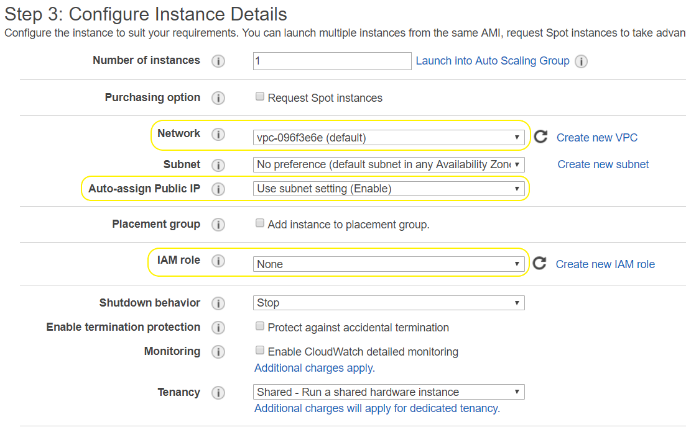

# Quick-Start Guide
This guide covers:
1. [Running  SilverKing on AWS](#running-simple-aws-based-instances) - try out SilverKing using our template ami
2. [Building Silverking on AWS](#building-silverking-on-aws) - build SilverKing on your own instance(s) and try out SilverKing

## Running Simple AWS-based Instances
### Getting the launch host started
If you'd like to give SilverKing a try, you can be up and running in minutes using an AWS instance from our template:<br>
&emsp;[SilverKing AMI](https://console.aws.amazon.com/ec2/v2/home?region=us-west-2#Images:visibility=public-images;search=SilverKing;sort=name) (ctrl+click to open in new tab)<br>
&emsp;AMI-Name: SilverKing<br>
&emsp;Platform: Amazon-Linux<br>
&emsp;Username: ec2-user<br>
&emsp;Region: US West (Oregon)<br>

1. In the AWS console, right click on the instance you want to run and click "Launch"
2. Choose an Instance Type: choose atleast a t2.micro 
3. Configure Instance:   

   - **Network**: I'm just using my default vpc<br>
*Make sure whatever VPC you are using with your instance, dns **resolution** and **hostnames** are both set to 'yes':
<br>
*You can view your [VPC's here](https://console.aws.amazon.com/vpc/home?region=us-west-2#vpcs:) (ctrl+click to open in new tab)
   - **Auto-assign Public IP**: we want this enabled so that we can ssh into this instance from a shell, like putty
   - **IAM role**: we need to add a role so that we can programmatically call aws api's, which is required to run our silverking cloud script<br>
<a name="CreateIAMRole"></a>
*If you don't have an EC2 IAM role, you need to [create one](https://console.aws.amazon.com/iam/home?region=us-west-2#/roles) (ctrl+click to open in new tab):
      - Click "Create role"
      - AWS service->EC2, Click "Next: Permissions"
      - Search: "AmazonEC2FullAccess", Select Check Box for "AmazonEC2FullAccess" Policy, Click "Next: Review"
      - Role name: "EC2Admin"
      - Click "Create role" button
4. Add Storage: I'm just using the defaults
5. Add Tags: I skip this
6. Configure Security Group: I select my normal security group that I use for all my aws usage<br>
*Make sure your security group contains an **Inbound Rule** for **All Traffic** with your _security group ID_ as the **Source**:
<br>
7. Review Instance Luanch: Click "Launch"

### Starting SK/SKFS
Once you have an AWS SilverKing AMI instance running, ssh into this instance (this is the master/launch host).<br>
You can run SilverKing on just this instance or on many instances.<br>
```ksh
cd ~/SilverKing/bin/
```

We tell SKCloudAdmin how many number of aws instances we want to run. If we pass in "-n 1", the script won't launch any more instances because we already have one, this instance, but if we pass in something like "-n 5", the script will launch 4 more instances for a total of 5.<br>
Let's keep it relatively simple and use a total of 3 aws instances, including this launch host, so "-n 3":
```ksh
./SKCloudAdmin.sh -c launchInstances -n 3   # this fires up the instances, preps them i.e. wires up ssh'ing capability between instances, starts zookeeper, and does some SilverKing prep work
```

You should now see 2 additional instances running in your aws console.<br>
Once the script returns, it should inform us of what command we run to start the SilverKing cluster:
```ksh
./SKAdmin.sh -G ~/SilverKing/bin/cloud_out -g GC_SK_cloud -c StartNodes,CreateSKFSns,CheckSKFS  # this starts sk and skfs
```

That's it! SilverKing is up and running. You can run 'ps uxww' to see all three processes.

You can now perform key-value operations using the skc tool ([skc usage](https://morgan-stanley.github.io/SilverKing/doc/Shell.html)):
```ksh
~/SilverKing/bin/skc -G ~/SilverKing/bin/cloud_out -g GC_SK_cloud    
skc> h;         # help menu
skc> cn testNs; # this creates a namespace
skc> p k1 v1;   # this puts a key: k1, with value: v1
skc> g k1 v1;   # gets the values for keys: k1 and v1
        k1 => v1
        v1 => <No such value>
skc> q;         # quit
```

You can also use the SKFS file system:
```ksh
cd /var/tmp/silverking/skfs/skfs_mnt/skfs
echo World > Hello
cat Hello
```

To shut down the SilverKing cluster:
```ksh
cd ~/SilverKing/bin
```

```
./SKAdmin.sh -G ~/SilverKing/bin/cloud_out -g GC_SK_cloud -c StopSKFS,StopNodes  # this stops sk and skfs
```

To terminate the aws instances:
```ksh
./SKCloudAdmin.sh -c terminateInstances    # this terminates all the worker instances. this current master/launcher instance will still be running, and you can terminate it using the aws console 
```

## Building SilverKing on AWS
You may also build SilverKing on AWS using simplified build scripts for both Amazon-Linux and Ubuntu.

### Amazon-Linux
```ksh
sudo yum -y install git ksh
cd ~
git clone https://github.com/Morgan-Stanley/SilverKing.git
~/SilverKing/build/aws/build_amazon_linux.sh
```

### Ubuntu
```ksh
sudo apt-get update 
sudo apt-get install git ksh    # 'apt-get update' first, or else you will get: "E: Unable to locate package ksh"
cd ~
git clone https://github.com/Morgan-Stanley/SilverKing.git
~/SilverKing/build/aws/build_ubuntu.sh
```